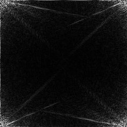
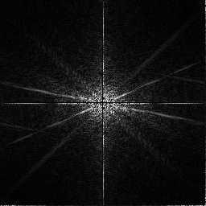

# 2-Dimensional-FFT without 1D FFT

This work extends the concept of FFT to 2 dimensions without applying FFT on rows and columns successively. This repository containes the c++ implementation of the [concept](https://github.com/vamshikumarkurva/2-Dimensional-FFT/2DFFT_without_1DFFT.pdf). Published paper is at [https://ijisrt.com/2d-fft-without-using-1d-fft-a-preprint](https://ijisrt.com/2d-fft-without-using-1d-fft-a-preprint)

**Usage**
```
g++ fft.cpp -L/usr/local/Cellar/opencv/3.3.0_3/lib -I/usr/local/Cellar/opencv/3.3.0_3/include/opencv -I/usr/local/Cellar/opencv/3.3.0_3/include -lopencv_core -lopencv_highgui -lopencv_imgproc -lopencv_imgcodecs
```

Opencv include path can be found using

```
pkg-config opencv --cflags
```

and library path can be found using

```
pkg-config opencv --libs
```

**Results**

Original image


Magnitude spectrum



Shifted Magnitude spectrum



